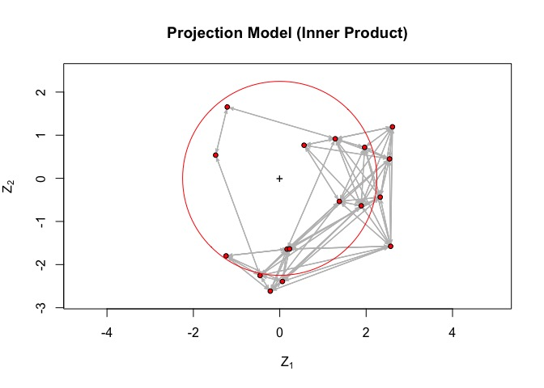
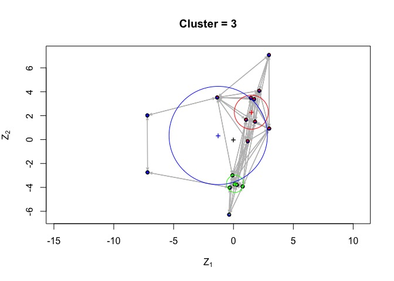
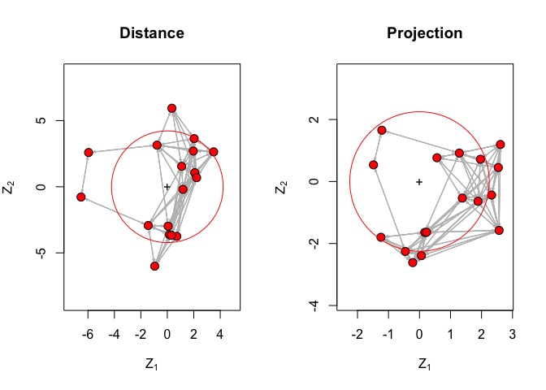
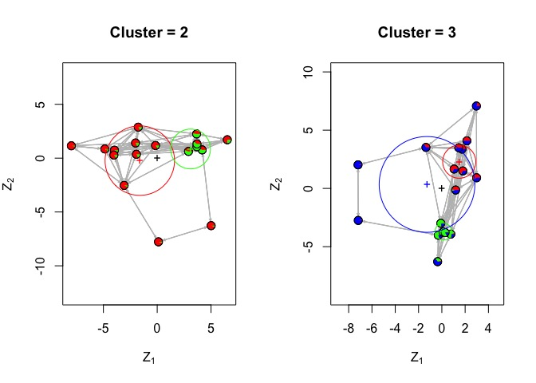

Econ 7217 Assignment 3
================

## packages and data

``` r
library(ergm)
library(sna)
library(latentnet)
library(network)

load('../data/dataset_ergmm.RData')
```

## Problem 1

Change the latent position model option from distance model to
projection model.

Here, using `bilinear()` instead of `euclidean()` inside `ergmm`
function.

``` r
model_1 <- ergmm(net ~ bilinear(d = 2), 
                 control=ergmm.control(burnin=100000,sample.size= 10000,interval=5))
```

### Estimation

The result summary was stated:

``` r
summary(model_1)
```

    ## 
    ## ==========================
    ## Summary of model fit
    ## ==========================
    ## 
    ## Formula:   net ~ bilinear(d = 2)
    ## Attribute: edges
    ## Model:     Bernoulli 
    ## MCMC sample of size 10000, draws are 5 iterations apart, after burnin of 1e+05 iterations.
    ## Covariate coefficients posterior means:
    ##             Estimate     2.5%   97.5% 2*min(Pr(>0),Pr(<0))  
    ## (Intercept) -0.84754 -1.71803 -0.0929               0.0294 *
    ## ---
    ## Signif. codes:  0 '***' 0.001 '**' 0.01 '*' 0.05 '.' 0.1 ' ' 1
    ## 
    ## Overall BIC:        265.0069 
    ## Likelihood BIC:     130.0511 
    ## Latent space/clustering BIC:     134.9558 
    ## 
    ## Covariate coefficients MKL:
    ##               Estimate
    ## (Intercept) -0.6893565

### Graph

The graphic
result:

``` r
plot(model_1, pie = T, main = 'Projection Model (Inner Product)', print.formula = F)
```

<!-- -->

## Question 2

Instead of using 2 groups, set the cluster-group number to
3.

``` r
model_2_fomula <- formula(net ~ nodematch("white") + nodematch("male") + euclidean(d=2, G=3))


model_2 <- ergmm(model_2_fomula,
                control=ergmm.control(burnin=100000,sample.size= 10000,interval=5))
```

### Estimation

The result summary shows that the male factpr is significant.

``` r
summary(model_2)
```

    ## 
    ## ==========================
    ## Summary of model fit
    ## ==========================
    ## 
    ## Formula:   net ~ nodematch("white") + nodematch("male") + euclidean(d = 2, 
    ##     G = 3)
    ## Attribute: edges
    ## Model:     Bernoulli 
    ## MCMC sample of size 10000, draws are 5 iterations apart, after burnin of 1e+05 iterations.
    ## Covariate coefficients posterior means:
    ##                 Estimate     2.5%  97.5% 2*min(Pr(>0),Pr(<0))    
    ## (Intercept)      6.85325  4.63861 9.4671               <2e-16 ***
    ## nodematch.white  0.26073 -1.05381 1.5153               0.6820    
    ## nodematch.male   2.15944  1.04594 3.4467               0.0004 ***
    ## ---
    ## Signif. codes:  0 '***' 0.001 '**' 0.01 '*' 0.05 '.' 0.1 ' ' 1
    ## 
    ## Overall BIC:        292.5813 
    ## Likelihood BIC:     116.1336 
    ## Latent space/clustering BIC:     176.4477 
    ## 
    ## Covariate coefficients MKL:
    ##                  Estimate
    ## (Intercept)     4.5820153
    ## nodematch.white 0.4168644
    ## nodematch.male  1.7313630

### Graph

As the figure shown, there are 3 groups (blocks) denoted by 3 circles
with different colors.

``` r
plot(model_2, pie = T, main = "Cluster = 3", print.formula = F)
```

<!-- -->

## P.S. Comparing to demo code setting

``` r
model1_fomula <- formula(net ~ euclidean(d=2))

model1 <- ergmm(model1_fomula,
                control=ergmm.control(burnin=100000,sample.size= 10000,interval=5))

model2_fomula <- formula(net ~ nodematch("white") + nodematch("male") +
                               euclidean(d=2,G=2))
model2 <- ergmm(model2_fomula,
                control=ergmm.control(burnin=100000,sample.size= 10000,interval=5))
```

### Model 1

``` r
par(mfrow=c(1,2))
plot(model1, pie = T, main = "Distance", vertex.cex = 2.5, print.formula = F)
plot(model_1, pie = T, main = "Projection",  vertex.cex = 2.5, print.formula = F)
```

<!-- -->

### Model 2

There is a problem that although using distance makes |z1 - z2| = |z2 -
z1|, which makes the result is invariant through the sign of z.

But as the figure below shown, my question is will the latent variable
position of nodes change, with only the cluster number is different?

``` r
par(mfrow=c(1,2))
plot(model2, pie = T, main = "Cluster = 2", vertex.cex = 2.5, print.formula = F)
plot(model_2, pie = T, main = "Cluster = 3",  vertex.cex = 2.5, print.formula = F)
```

<!-- -->
